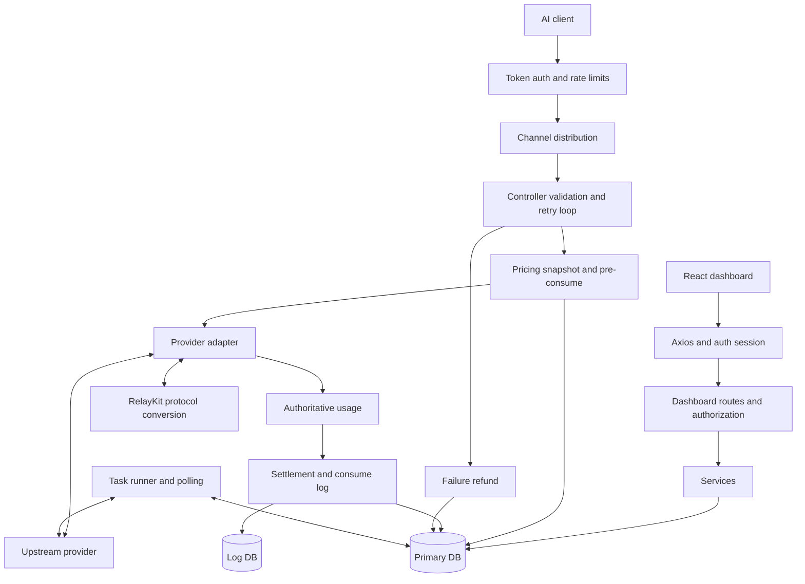

# Architecture Review and Refactoring Record

Date: 2026-09-08

## Scope and Evidence

This review follows application startup, dashboard authentication, relay dispatch,
usage conversion, settlement, asynchronous polling, database boundaries, and the
frontend HTTP client. It is a targeted code review, not an exhaustive security
audit of every provider or UI component.

The workspace already contains uncommitted HCAI integration changes. The earlier
HCAI usage, proxy, and endpoint fixes remain in place. This review adds two
behavior-preserving service refactors and their contract tests; it does not claim
to resolve the reliability changes listed below.

## Prioritized Findings

### P1: Billing failures have no durable recovery record

Evidence: `service/billing_session.go:55`, `service/billing_session.go:68`,
`service/billing_session.go:107`, `service/text_quota.go:451`.

Funding and token adjustments commit separately. If funding succeeds and the
token update fails, the session still becomes settled. The caller logs the error
and continues producing the consume log. A failed refund similarly logs an error
inside a goroutine after the in-memory session was marked refunded. A database
failure or process exit can therefore leave wallet/subscription usage, token
quota, and consume records inconsistent without an automatic recovery path.

Do not blindly retry wallet credits: `WalletFunding.Refund` is explicitly
non-idempotent. Add request-scoped accounting operation IDs and durable pending
operations before implementing retries. Status: deferred to a dedicated
accounting migration, with failure-injection tests required.

### P1: Accepted HCAI tasks can be submitted again after a polling failure

Evidence: `relay/channel/hcai/adaptor.go` (`DoResponse`, `poll`),
`controller/relay.go:242`, `setting/operation_setting/status_code_ranges.go`.

The accepted task ID lives only in the current HTTP request. A transient query
failure becomes a generic 502, which is eligible for the configured relay retry
policy. When retries are enabled, the next attempt can submit another image task
even though the first is still running upstream. Exhausted retries also trigger
the normal refund path without reconciling the accepted task.

Persist the upstream task ID and resume polling that task. Distinguish submission
failure, accepted-but-pending, and terminal failure. Reuse the existing task
polling/settlement infrastructure where its contract fits. Merely disabling
retries does not solve lost tasks or incorrect refunds. Status: not changed by
this behavior-preserving refactor.

### P2: Frontend GET deduplication ignores request semantics

Evidence: `web/src/lib/http-client.ts:55`.

The key uses session ID, URL, and serialized params, but not `responseType`,
headers, cancellation signal, or error-handling options. Two concurrent callers
with equal keys receive the first caller's promise and configuration. For
example, one caller's cancellation can cancel another caller's work, and a
second caller requesting a different response representation receives the first
representation. `disableDuplicate` is an escape hatch, not an enforced contract.

Use TanStack Query for shared resource fetching. For transport-level requests,
deduplicate only a documented subset of compatible configurations; bypass
deduplication for independently cancellable or differently configured requests.
Add controlled concurrent-request tests before changing this API. This is a
static contract finding; no browser reproduction was performed in this review.

### P2: Provider capabilities are maintained in multiple registries

Evidence: `constant/channel.go`, `common/api_type.go`,
`common/endpoint_type.go`, `relay/relay_adaptor.go`,
`web/src/features/channels/constants.ts`,
`web/src/features/channels/lib/channel-type-config.ts`.

A provider addition requires synchronized edits to identifiers, adapter
selection, endpoint inference, and frontend configuration. The earlier HCAI
endpoint mismatch demonstrates a concrete failure mode. Introduce a backend
capability descriptor first, retaining existing numeric IDs, then expose or
generate frontend metadata. Keep adapter factories in the relay layer to avoid
introducing an import cycle into common/constants.

### P2: Runtime dependencies and request state cross layer boundaries

Evidence: `service/task_polling.go:37`, `model/main.go:53`,
`middleware/distributor.go`, `relay/common/relay_info.go`, `main.go`.

The system is a modular monolith, but not a strict Router -> Controller ->
Service -> Model dependency graph. Services depend on relay types, adapters
depend on services, and main injects a global adapter factory to avoid a cycle.
Database handles and settings are global; Gin keys and a large mutable
RelayInfo carry channel selection, retry, billing, and transport state.

These choices make startup ordering and test fixtures significant. Extract
small consumer-owned interfaces and pass dependencies to the task runner and
billing entry points incrementally. Separate immutable request identity from
per-attempt channel state. Avoid a repository-wide dependency-injection rewrite.

### P2: Audit classification repeated usage conversion and deep copies (fixed)

Evidence: `service/billing_usage.go:27`,
`service/text_quota.go:399`, `service/text_quota.go:479`.

Settlement already converts authoritative usage. The audit path previously
converted it again merely to identify its protocol, including cloning billing
payloads and Gemini detail slices. A shared semantic selector now drives both
conversion and audit classification. Only conversion allocates converted usage.
The established OpenAI > Claude > Gemini precedence is unchanged.

### P3: Administrator audit-object initialization was duplicated (fixed)

Evidence: `service/billing_usage.go:57`, `service/log_info_generate.go:22`.

Usage provenance and quota saturation independently created or repaired
`other.admin_info`. Both now use `appendAdminLogField`. Existing administrator
metadata, nil behavior, invalid legacy values, and the serialized field nesting
are retained. The nesting matters because `model/log.go:116` strips admin_info
from ordinary user log responses.

### P3: Billing documentation points to removed frontend paths

Evidence: `pkg/billingexpr/expr.md:157`, `pkg/billingexpr/expr.md:271`.

The document still refers to JSX files under `web/src/pages/Setting/Ratio` and
`web/src/helpers`. Current implementations include
`web/src/features/system-settings/models/tiered-pricing-editor.tsx` and
`web/src/features/pricing/lib/billing-expr.ts`. Refresh the file map without
changing expression semantics; consider checking documentation links in CI.

## Architecture Summary

The application is a Go modular monolith with an embedded React SPA. The root
module currently declares Go 1.25.1. RelayKit is a separate Go module and must
remain buildable without root-module or workspace wiring.

| Area | Main responsibility |
| --- | --- |
| main / router | Resource initialization, background jobs, middleware composition, HTTP and embedded UI |
| middleware | Dashboard/token authentication, authorization, rate limiting, request storage, channel distribution |
| controller | Dashboard operations and relay request/retry orchestration |
| relay / channel | Provider transport, request adaptation, streaming, response handling |
| relaykit | Protocol DTOs and request/response/stream semantic conversion; no wallet or database ownership |
| service | Pricing, settlement, funding sources, authentication sessions, notifications, task processing |
| model | GORM persistence, migrations, cached data access, task state and accounting updates |
| common / setting | Infrastructure helpers, quota conversion bounds, runtime configuration and pricing options |
| web | React 19, TanStack Router/Query, Zustand, Axios, Base UI/Tailwind, i18next |

Primary storage supports SQLite, MySQL, and PostgreSQL. Log storage has a separate
handle and includes a ClickHouse path. Redis and in-process caches reduce database
access but require explicit invalidation and multi-node synchronization.



Text relay validates inputs, estimates tokens, snapshots pricing, reserves quota,
and calls an adapter. Failed attempts can select another channel/group and
refresh group-dependent reservations. Successful usage is normalized for the
actual upstream protocol before settlement and audit logging. Stream output may
already be delivered when accounting occurs, which is why settlement failures
need durable recovery rather than an HTTP retry.

Dashboard authentication has a distinct session/PAT boundary from relay API
tokens. The browser uses a shared HTTP client for credentials and auth refresh,
TanStack Query for server state, and feature-local UI/state modules.

The persisted async task path uses polling and guarded status transitions.
HCAI's synchronous waiting wrapper currently sits outside that persisted task
lifecycle; this is the architectural reason for its recovery gap above.

## Refactoring Plan

| Stage | Work | Acceptance criteria | Status |
| --- | --- | --- | --- |
| 1 | Characterize authoritative usage selection and audit metadata; share selector and audit writer | Same results before and after; no mutation; zero classification allocations | Complete |
| 2 | Durable accounting operation IDs, pending settlement/refund records and reconciliation | Inject failure between funding/token/log updates; restart worker; no duplicate debit or credit on all three main databases | Planned |
| 3 | Persist accepted async provider tasks and resume their polling | Query failure and process restart never resubmit an accepted job; exactly-once terminal accounting | Planned |
| 4 | Define HTTP deduplication semantics and test independent subscribers | Cancellation, representation, headers and error preferences remain caller-correct | Planned |
| 5 | Consolidate capability metadata while preserving IDs and provider-specific differences | Endpoint advertisements and adapters agree; frontend metadata stays compatible | Planned |
| 6 | Introduce explicit task-runner dependencies and refresh architecture/file-map documentation | Runner lifecycle and fixtures no longer depend on mutable global factory; RelayKit remains independent | Planned |

Do not merge superficially similar usage normalizers without checking semantics:
the OpenAI image handler deliberately overwrites image input/output fields,
whereas authoritative billing normalization fills missing canonical fields.
Likewise, Claude cache token inclusion differs from OpenAI. Those are protocol
contracts, not accidental duplication.

## Implemented Code

- `service/billing_usage.go`: `billingUsageSemantic` selects the authoritative
  payload without allocating. Both settlement conversion and audit provenance
  use this selector; the conversion routines and quota arithmetic are unchanged.
- `service/log_info_generate.go`: `appendAdminLogField` merges audit fields under
  the existing administrator-only object.
- `service/billing_usage_contract_test.go`: deterministic behavior contracts and
  a focused allocation benchmark.

## Verification

New characterization tests were run successfully against the original service
implementation before refactoring, then rerun successfully after refactoring.
They cover 14 named payload cases, both estimated flags and local/upstream
fallback modes, including whitespace/case, missing payloads, conflicting source
metadata, explicit zero usage, source immutability, and administrator metadata
preservation. Existing text quota tests continue to verify exact calculated
charges and protocol-specific cache normalization.

Executed successfully:

```sh
go test ./service -run 'TestBillingUsageSelectionContract|TestBillingAuditFieldsPreserveLogContract' -bench '^BenchmarkUsageBillingPathForLog$' -benchmem
go test ./...
cd relaykit
GOWORK=off go test ./...
GOWORK=off go build ./...
```

`git diff --check` also passed for the code changes.

Benchmark on this machine (Apple M1 Pro, darwin/arm64), using the same Gemini
fixture before and after:

| Implementation | ns/op | B/op | allocs/op |
| --- | ---: | ---: | ---: |
| Before | 218.7 | 472 | 5 |
| After | 14.27 | 0 | 0 |

These numbers describe only provenance classification, not end-to-end gateway
throughput. Timing varies across runs. The regression evidence covers the stated
contracts, not a proof of equivalence for every possible program execution.

Some full-suite results used Go's test cache. No live provider calls, browser E2E,
production load test, or live MySQL/PostgreSQL/ClickHouse matrix was executed.
Frontend files and financial recovery behavior were not changed in this stage.
